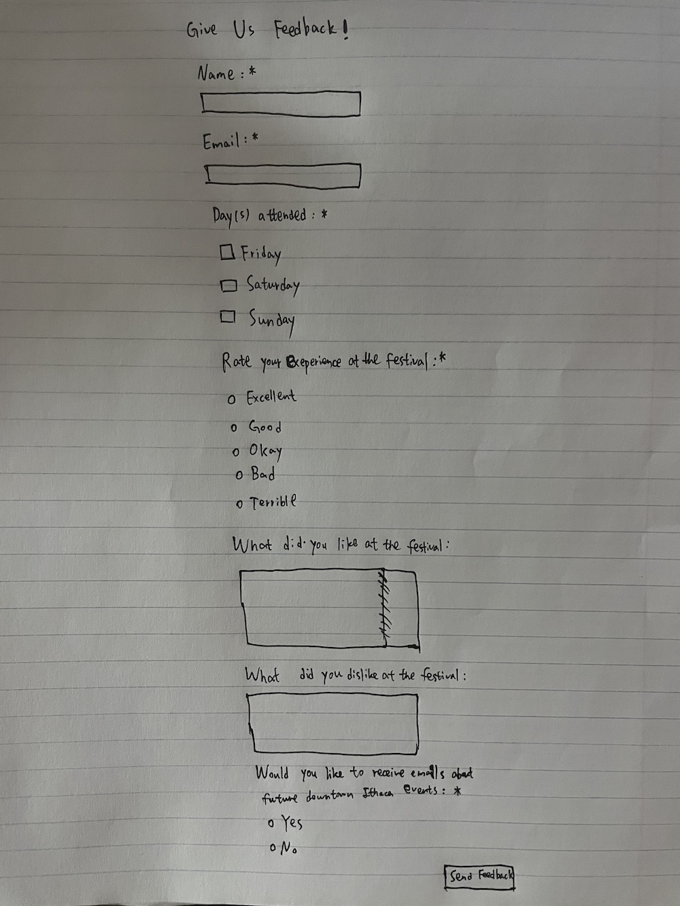
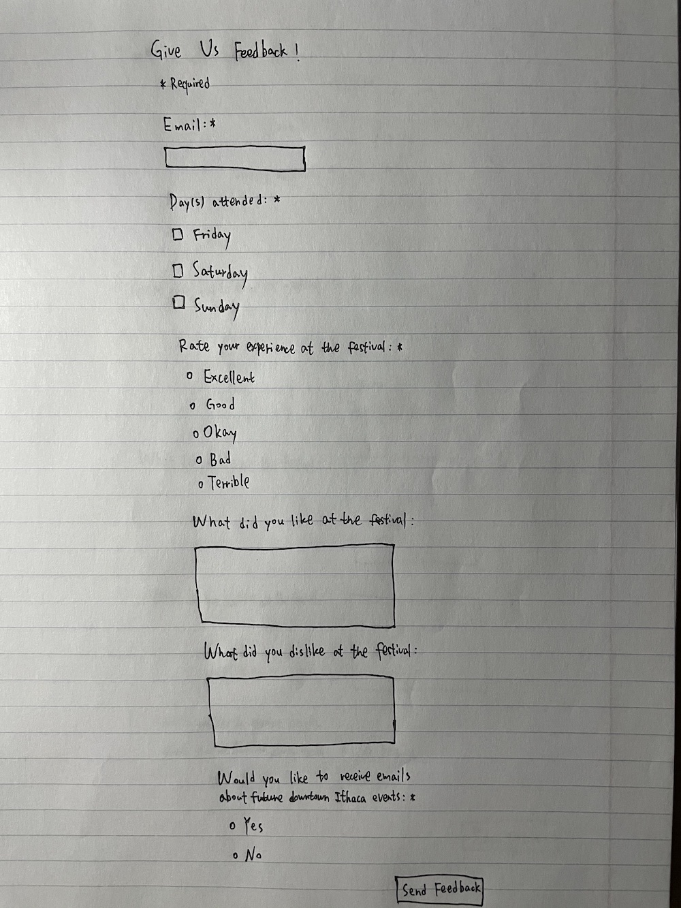

# Project 3: Design Journey

**For milestones, complete only the sections that are labeled with that milestone.**

Be clear and concise in your writing. Bullets points are encouraged.

**Everything, including images, must be visible in Markdown Preview.** If it's not visible in Markdown Preview, then we won't grade it. We won't give you partial credit either.

**Make the case for your decisions using concepts from class, as well as other design principles, theories, examples, and cases from outside of class.**

You can use bullet points and lists, or full paragraphs, or a combination, whichever is appropriate. The writing should be solid draft quality but doesn't have to be fancy.

## Project 1 or Project 2
> Which project will you add a form to?

Project 2


## Audience (Milestone 1)
> Who is your site's target audience? This should be the original audience from Project 1 or Project 2. You may adjust the audience if necessary. Just make sure you explain your rationale for doing so here.

The target audience is Cornell students who may have heard of Ithaca Apple Harvest Festival but have never visited it before. This is the original audience from Project 2.


## Audience's Needs (Milestone 1)
> List the audience's needs that you identified in Project 1 or 2. Just list each need. No need to include the "Design Ideas and Choices", etc. You may adjust the needs if necessary. However, any changes you make to the needs for this project should be clearly identified and justified.

- Brief description of the festival
- A list of photos from past events
- A list of events or activities at the festival
- Ways to get there and parking information


## HTML Form + User Needs Brainstorming (Milestone 1)
> Using the audience needs you identified, brainstorm possible options for an HTML form for the site. List each idea and provide a brief rationale for how the HTML form addresses that need.

- The form will be a feedback form for first-time visitors who would like to provide feedback after they have attended the Apple Harvest Festival, also they can opt in to further email updates on relevant downtown Ithaca events. With this form, we can better understand first-time visitors' experience and thoughts, and improve our website based on those feedbacks. Then, we can address the audience needs better.
- The form will allow users to request a summarized list of events to be sent to their emails. The audience want to know what kinds of events or activities will be at the festival, so they can request such a summarized list and view the list more easily.


## HTML Form Proposal & Rationale (Milestone 1)
> Make a decision about your site's form. Describe the purpose of your proposed form for your Project 1 or 2 site. Provide a brief rationale explaining how your proposed form meets the needs of your site's audience.
> Note: If your form is a contact form, we expect to see a thorough justification explaining how a contact form addresses the user's _actual_ needs. In your justification explain how a contact form better suits the needs of your user compared to the alternatives (e.g. sending you an email using your email address).

Form Proposal: The form will be a feedback form for first-time visitors who would like to provide feedback after they have attended the Apple Harvest Festival (what days did you attended? how did you like the festival? any improvements?), also they can opt in to further email updates on relevant downtown Ithaca events.

User Needs Rational: The purpose of this website is to provide useful and accurate information for first-time visitors. With this form, we can collect relevant information from audience, better understand their experience and thoughts, and enhance the quality of the website. Therefore, we can better address user needs.


## Form User Data (Milestone 1)
> Think through and plan the data you need to collect from the users. Do you need their name? Email address? etc.

- Email
- Days attended
- Rate experience at the festival
- What did the users like?
- What did the users dislike?
- Want to receive email updates?


At milestone 1, I included the name as the data that needed to be collected. But based on the feedback and my further consideration, I realized that anonymous form would encourage more people to give the feedback, and having the name as a field might limit the amount of people who want to fill out the form. So, I decided to remove the name as a field.


## Form Components & Validation Criteria (Milestone 1)
> For each piece of data you plan to collect from the users, identify an appropriate HTML component to collect that data and decide the validation criteria (e.g. whether this data is _required_). Briefly explain your reasoning for the component choice and the validation criteria.

- Email (required): email field; `<input type="email">`; Email field is exactly for email, and email is required in order to contact the user and also let user have the opportunity to receive further updates
- Days attended (required): checkbox field; `<input type="checkbox">`; Because we have only a few possible days normally (Friday, Saturday, Sunday), and users might visit for more than one day, then a checkbox that allows multiple-selection is appropriate. This field is required in order to know which days users attended the festival
- Rate experience at the festival (required): radio buttons; `<input type="radio">`; Radio buttons are appropriate because we need single selection for rating, and this field is required so the feedback can be useful to get a general opinion of how the user experience was
- What did the users like: multi-line text field; `<textarea>`; Textarea is appropriate because users may have multiple lines of words, and this is optional because users may have a general opinion but not a specific one
- What did the users dislike: multi-line text field; `<textarea>`; Textarea is appropriate because users may have multiple lines of words, and this is optional because users may have a general opinion but not a specific one
- Want to receive email updates (required): radio buttons; `<input type="radio">`; First I want to use a checkbox but I think users may not notice that, so I decide to use radio buttons and make this field as required
- Submit: submit button; `<button type="submit">`;


## Form Location (Milestone 1)
> Which HTML file will you place your form?

A separate page (feedback.html)

> Sketch the location of the form in that page. This sketch need not be fancy. You don't need to provide many details of the page or form. Just plan the location of the form on the page and communicate that to us. You can literally have a box that says "FORM HERE."

**Desktop Location**


Sketch for desktop location


**Mobile Location**


Sketch for mobile location


## Form Design (Milestone 1)
> Include sketches on your form below. Include sketches of your **mobile and desktop** versions without corrective feedback. Show us the evolution of your design and the alternatives you considered.

**Desktop Sketches**


Sketch for desktop form version 1

At the first version, I applied the scanning/arching pattern. I also aligned the components to increase readability.


Sketch for desktop form version 2

Based on the first version, I made several changes. First, I used some white space between components. Second, I displayed the radio options and checkbox options vertically instead of horizontally. Here, we could easily separate different options. Third, for the submit button, I used "Send Feedback" instead of "Submit" to better describe the action. I decided to continue with my second version.


Sketch for desktop form version 3

After milestone 1, I decided to remove the name as a field because anonymous form would encourage more people to give feedback. In this version, I also added a "Required" indicator at the beginning of the form to clearly label components as required.

**Mobile Sketches**


Sketch for mobile form version 1

I designed the mobile version based on the desktop version 2. In mobile version, in order to increase readability, I aligned all components to the left and I also placed labels on-top. This design also supported scanning/arching reading pattern.


Sketch for mobile form version 2

I designed this mobile version based on the desktop version 3.


## Form Feedback Design (Milestone 1)
> Include sketches of your **mobile and desktop** with _corrective feedback_. Show us the evolution of your design and the alternatives you considered.

**Desktop Feedback**


Sketch for desktop feedback version 1

I displayed the corrective feedbacks on-top of the components. I also used red color for those feedbacks.


Sketch for desktop feedback version 2

This is the feedback version based on the corresponding desktop sketch version 3. In this version, I also changed the feedback message for "Day(s) attended" field to "Please select at least one day". Because I had a group of checkboxes for that field, then it was more appropriate to tell the users to select at least one option.


**Mobile Feedback**


Sketch for mobile feedback version 1

I displayed the corrective feedbacks on-top of the components. I also used red color for those feedbacks.


Sketch for mobile feedback version 2

This is the feedback mobile version based on the corresponding desktop version.


## Form Implementation Planning (Milestone 1)
> What submission method will your form use? GET or POST. Explain your reasoning.

POST. There is some personal information that should not be included in the url, and the form should only be submitted once, so the form should use POST method.

> For your site's `<form>` element, plan all HTML attributes that you will need and their values. Hint: action=, method=, novalidate

- `method="post"`
- `action="https://www.cs.cornell.edu/courses/cs1300/2020fa/submit.php"`
- `novalidate`


## Additional Information (Milestone 1)
> (optional) Include any additional information, justifications, or comments we should be aware of.

In the lectures, the professor mentioned that we should not use "required" attribute for checkbox. But in "Day(s) attended" of my form, I needed a component that supported multiple-selection. Thus, I still used a checkbox with "required" attribute.

But the professor provided us "At Least One Checkbox Checked Snippet" this week, so, this was no longer an issue.


## Plan Validation Pseudocode (Final Submission)
> Write your form validation pseudocode here.

```
when user submits form ("On Form Submit Event" snippet):
  if email component is valid ("Check Component Validity" snippet):
    hide email feedback
  else
    show email feedback

  if Friday is checked or Saturday is checked or Sunday is checked ("At Least One Checkbox Checked" snippet):
    hide days-attended feedback
  else
    show days-attended feedback

  if rate component is valid ("Check Component Validity" snippet):
    hide rate feedback
  else
    show rate feedback

  if receive-update component is valid ("Check Component Validity" snippet):
    hide receive-update feedback
  else
    show receive-update feedback

  if form is valid (no feedback):
    send data to server
  else
    prevent form from sending data to server
```


## Additional Design Justifications (Final Submission)
> If you feel like you haven’t fully explained your design choices in the final submission, or you want to explain some functions in your site (e.g., if you feel like you make a special design choice which might not meet the final requirement), you can use the additional design justifications to justify your design choices. Remember, this is place for you to justify your design choices which you haven’t covered in the design journey. Use it wisely. However, you don’t need to fill out this section if you think all design choices have been well explained in the final submission design journey.

None


## Self-Reflection (Final Submission)
> This was the first project in this class where you coded some JavaScript. What did you learn from this experience?

I learned how to implement client-side interactivity with JavaScript, and I also had experience in coding some JavaScript. With this knowledge, I was able to implement form validation and custom feedback.


> Reflect on how HTML, CSS, and JavaScript together support client-side interactivity. If it's helpful, you can describe your mental model of client-side interactivity or explain how the general idea of showing and hiding content can be used to implement other forms of client-side interactivity beyond form validation and feedback.

We use HTML to structure the webpage, use CSS to style it, and use JavaScript to implement the interactivity. We first finish HTML and CSS coding and then hide the desired content using a CSS class. Then we can use JavaScript to dynamically show and hide the content when corresponding events occur. For example, if we want to implement a hamburger menu, we code the HTML and CSS parts first and then we can hide the menu using a CSS class. We then use JavaScript to show or hide the menu when the hamburger is clicked.


> Take some time here to reflect on how much you've learned since you started this class. It's often easy to ignore our own progress. Take a moment and think about your accomplishments in this class. Hopefully you'll recognize that you've accomplished a lot and that you should be very proud of those accomplishments!

I learned how to design the webpage from scratch, how to structure the webpage using HTML, how to style the webpage using CSS and how to implement client-side interactivity using JavaScript. I have finished a professional and polished website about my resume, and I have redesigned an existing website to make it more appropriate for target audience, and also I have implemented form validation and custom feedback. 
